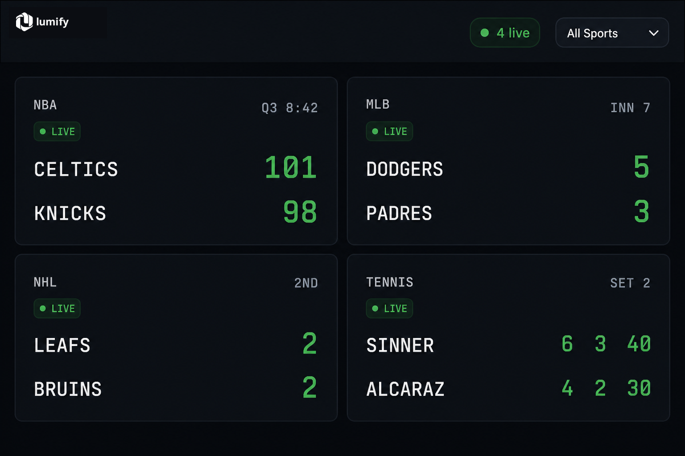

# Live Scoreboard Example

A small, copy-pasteable demo that builds a **live sports scoreboard** on top of the [Lumify API](https://lumify.ai).

Companion walkthrough: **[Build a live sports scoreboard with the Lumify API](https://lumify.ai/use-cases/live-scoreboard)**



## What it does

1. **Discovers** in-progress games with `GET /v1/events?status=inprogress&include_scores=true&sort=status`
2. **Streams** live score / clock / period updates per game with `GET /v1/events/{id}/stream` (SSE)
3. **Falls back** to polling `GET /v1/events/{id}/score` every 15s if SSE isn't available

Your Lumify API key stays on a tiny Express server. The browser only talks to `localhost`.

```
Browser  ──►  Express proxy (holds LUMIFY_API_KEY)
                 │
                 ├── GET /v1/events?status=inprogress…
                 ├── GET /v1/events/{id}/score
                 └── GET /v1/events/{id}/stream  (SSE, auto-reconnects)
                          │
                          ▼
                     Lumify API (https://lumify.ai)
```

## Quick start (≈ 60 seconds)

From this directory in the [Lumify public repo](https://github.com/lumifyai/lumify):

```bash
git clone https://github.com/lumifyai/lumify.git
cd lumify/examples/scoreboard
npm install

cp .env.example .env
# Paste a key from https://lumify.ai/docs (instant trial, no signup)
# or https://lumify.ai/api-keys

npm start
# → open http://localhost:3000
```

Or, if you already have this monorepo checked out:

```bash
cd examples/scoreboard
npm install
cp .env.example .env   # set LUMIFY_API_KEY
npm start
```

Requirements: Node.js 18+.

## Project layout

```
.
├── server.js           # Express proxy + SSE re-emit
├── public/
│   ├── index.html      # Scoreboard shell
│   ├── logo.webp       # Official Lumify logo asset
│   ├── scoreboard.js   # Discover → stream / poll → render
│   └── styles.css
├── .env.example
└── package.json
```

## API surface used

| Lumify endpoint | Demo route | Purpose |
|---|---|---|
| `GET /v1/events?status=inprogress&include_scores=true&sort=status` | `GET /api/live-games` | Find live games (optional `?sport=`) |
| `GET /v1/events/{id}/score` | `GET /api/games/:id/score` | Lightweight score snapshot (poll fallback) |
| `GET /v1/events/{id}/stream` | `GET /api/games/:id/stream` | Push updates (`score` / `done` / `reconnect`) |

Auth header (server-side only):

```http
Authorization: Bearer lmfy-…
```

Docs:

- [List events](https://lumify.ai/docs/reference#events)
- [Event score](https://lumify.ai/docs/reference#event-score)
- [Event stream (SSE)](https://lumify.ai/docs/reference#event-stream)
- [Rate limits](https://lumify.ai/docs/rate-limits)
- [Best practices](https://lumify.ai/docs/best-practices) — never put a real key in browser JS

## Notes

- Lumify caps a single SSE connection at **5 minutes** and emits `event: reconnect` before closing. The official `@lumifyai/sdk` (`client.events.stream()`) reconnects automatically — this demo relies on that so a long game looks continuous.
- Each API key may hold a limited number of concurrent streams (5). The UI falls back to `/score` polling if the stream errors repeatedly.
- Respect `Retry-After` / `X-RateLimit-*` headers on `429` responses.
- When nothing is live, the board stays empty and rediscovers every 30s. Filter by sport with the dropdown.

## License

MIT — see [LICENSE](./LICENSE).
